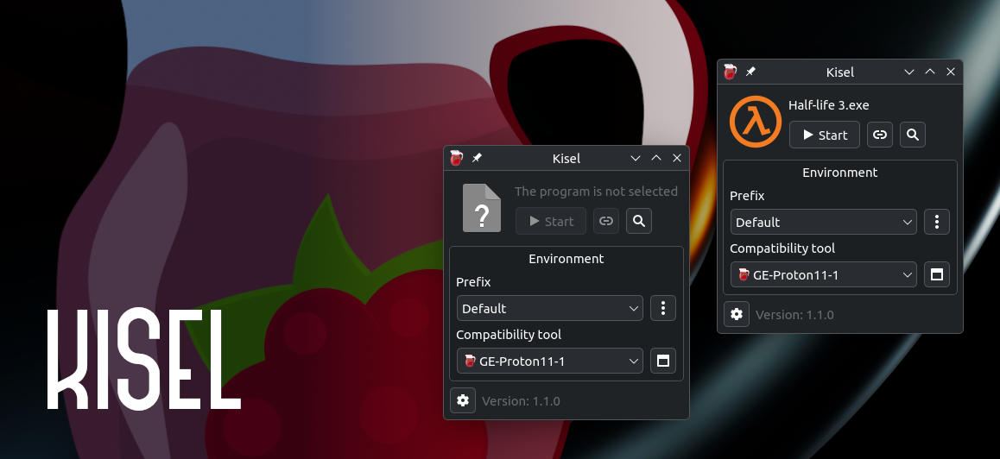

[На русском](docs/README_RU.md)

# Kisel

Efficient launch of Windows programs



## Highlights
- It can run games without Steam using [umu-launcher](https://github.com/Open-Wine-Components/umu-launcher), and with it
- Compatibility with the Steam environment
- C++ code and minimal actions to run exe
- Ability to create desktop shortcuts instead of displaying the list of added applications
- Managing Prefixes and Compatibility Tools (Proton)
- Installing additional prefix dlls
- OnlineFix Support (Disabled by default)
- Support for downloading compatibility tools:
    - Proton-GE (Default)
    - Proton-CachyOS
- Configure the following parameters:
    - Runtime auto-update
    - Using Steam or umu-launcher
    - MangoHud
    - OBS Vulkan Game Capture
    - Xalia
    - Wayland driver
    - Steam Environment
    - WOW64
    - OnlineFix
- Available translations:
    - English
    - Русский

## Dependencies
- qt6-base: Graphical interface
- [umu-launcher](https://github.com/Open-Wine-Components/umu-launcher): Way to launch Windows applications without Steam
- icoutils: Extracting icons
- #### Optional:
    - winetricks: Additional scripts for working with Wine prefix
    - mangohud: Overlay for monitoring FPS, temperature, CPU/GPU load
    - obs-vkcapture: Vulkan game capture plugin for OBS

## Installation

### Arch Linux
[Download the latest version of pkg.tar.zst](https://github.com/seinedkoda/kisel/releases/latest)

```bash
sudo pacman -U kisel-*.pkg.tar.zst
```

### Build from source using CMake

*Qt6 LinguistTools (qt6-tools) required*

```bash
git clone https://github.com/seinedkoda/kisel.git
cd kisel
cmake -B build -DCMAKE_BUILD_TYPE=Release && cmake --build build
```

## License
*GPL-3.0*