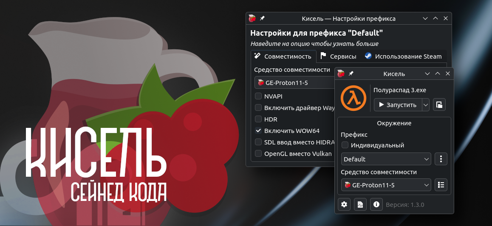

# Кисель

Эффективный запуск Windows программ




## Основное🍒
- Возможность запуска игр без Steam с помощью [umu-launcher](https://github.com/Open-Wine-Components/umu-launcher), а также с ним
- Совместимость со средой Steam
- Код на C++ и минимальные действия для запуска exe-файлов
- Возможность создания ярлыков на рабочем столе вместо отображения списка добавленных приложений
- Управление префиксами и инструментами совместимости (Proton)
- Установка дополнительных DLL-файлов в префиксы
- Поддержка OnlineFix (по умолчанию отключено)
- Поддержка загрузки инструментов совместимости:
    - [Proton-GE]([Proton-GE](https://github.com/GloriousEggroll/proton-ge-custom)) (по умолчанию)
    - [Proton-CachyOS]([Proton-CachyOS](https://github.com/CachyOS/proton-cachyos))
- Настройка следующих параметров:
    - Автоматическое обновление среды выполнения
    - Использование Steam или umu-launcher
    - MangoHud
    - OBS Vulkan Game Capture
    - Xalia
    - NVAPI
    - Драйвер Wayland
    - HDR
    - SDL Input
    - Использование среды Steam
    - WOW64
    - OnlineFix
    - И ещё некоторые...

## Установка 📦

### Arch Linux
**[Загрузите последнюю версию pkg.tar.zst](https://github.com/seinedkoda/kisel/releases/latest)**
```bash
sudo pacman -U kisel-*.pkg.tar.zst
```

### Debian
**[Загрузите последнюю версию deb](https://github.com/seinedkoda/kisel/releases/latest)**
```bash
sudo apt install ./kisel-*.deb
```

### Fedora
**[Загрузите последнюю версию rpm](https://github.com/seinedkoda/kisel/releases/latest)**
```bash
sudo dnf install ./kisel-*.rpm
```

### Сборка из исходного кода
- **Зависимости:**
  - qt6-base
  - icoutils
- **Зависимости для сборки:**
  - cmake
  - qt6-tools
- **Опциональные зависимости:**
  - winetricks
  - mangohud
  - obs-vkcapture

```bash
git clone https://github.com/seinedkoda/kisel.git
cd kisel
cmake -B build -DCMAKE_BUILD_TYPE=Release && cmake --build build
```

## Поддержать 🥴

**[Boosty](https://boosty.to/seinedk/donate)**

## Лицензия 📖
Данный проект распространяется под лицензией **GNU General Public License v3.0** (GPLv3).
Для получения дополнительной информации см. файл [LICENSE](LICENSE).

### Сторонние ресурсы

- **[Papirus Icon Theme](https://github.com/PapirusDevelopmentTeam/papirus-icon-theme)** - запасной набор иконок
  - **Автор:** Papirus Development Team
  - **Лицензия:** [GNU General Public License v3.0 (GPLv3)](resources/icons/thirdparty/Papirus/LICENSE)
  - **Изменения:** Изменён index.theme, убраны неиспользуемые иконки